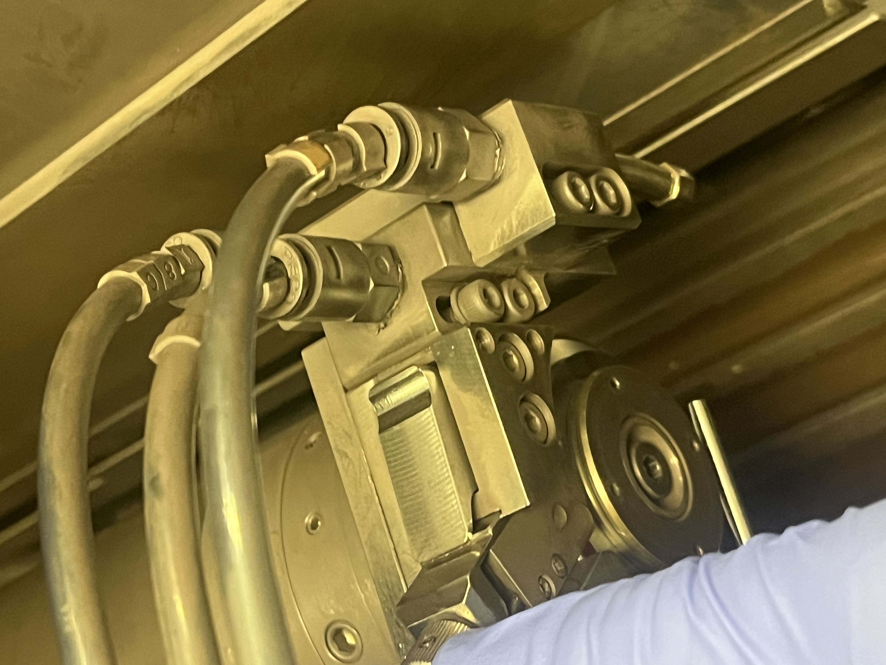

**Date:** 2024-06-11

## Description
The Dicing Saw system is used for cutting semiconductor wafers into individual dies. This equipment ensures precision cutting with minimal damage to the wafer and die.

## Manufacturer
- **Brand:** DISCO
- **Model:** DAD3240

## Specifications
- **Cutting Method:** High-speed rotating blade
- **Blade Type:** Diamond
- **Spindle Speed:** 6000 - 60000 RPM
- **Cutting Speed:** 0.1 - 600 mm/sec
- **Blade Diameter:** 2” to 4”
- **Substrate Size:** Up to 200 mm diameter
- **Software:** Custom control software with recipe management

## Components
- **Blade Spindle:** Rotates the dicing blade at high speed.
- **Worktable:** Holds the wafer during the dicing process.
- **Cooling System:** Supplies coolant to the blade to prevent overheating.
- **Vacuum Chuck:** Secures the wafer to the worktable.
- **Camera System:** Provides real-time visual feedback for alignment and cutting.

### Keteca, P/N K3T20L45 Specifications
- Kerf (width of cut): 51 μm
- Blade exposure (new): 1.14 mm
- Recommended cutting speed: 3-5 mm/sec
- RPM recommended 30000
- Maximum Cutting Speed: 15 mm/sec
- Blade Height: 0.08 mm (height of blade above the chuck table during dicing (change if mounting a sample to a substrate))

#### **Disco Input**
- Blade Exposure: 0.9 mm
- Blade Height: 0.08 mm
- Feed Speed: 3mm/s
- Work Size: Round - 150 mm
- Work Thickness: 0.675 mm
- Tape Thickness (blue): 0.120 mm
- Spindle Rev: ? 30 000

## Safety Precautions
- Do not grab/handle a blade by its edge; this can cut your fingers.
- Operating the saw without covers (this saw has an automatic safety cover), which increases the amount of particles that enter your lungs.
- Always wear the appropriate PPE.
- Pinching your fingers between the chuck table and the dicing ring.

## Quick Checklist
- Coat the wafer with 1-2 μm of photoresist.
- Know the thickness of the wafer. Measure with a caliper if needed.
- Know the specs of the blade you are using before enabling the tool. Never attempt to make a cut that is deeper than the exposed amount of saw blade
- Always perform a Non-Contact Setup after changing the blade and make sure to input and **[SAVE]** (press **[ENTER]**) the standard blade exposure
- Make sure cooling water is being supplied to the cutting area (only comes on during a cut). The three flow meters on the left side of the machine should read: **BLADE ∼ 1.5 (L/min.)**, **SHOWER ∼ 1.0 (L/min.)**, and **SPRAY ∼ 1.0 (L/min.)** during cutting operation.
- If the C/T vacuum is sufficient, -60 kPA or more. There is a digital gauge on the main screen which shows the vacuum level on the chuck. Make sure the green bar is filled past the red line during vacuum check

## Operation Procedure
1. **System Preparation**
   - Turn on the tool.
   - Check that the system is properly vented (> 0.4 MPA) and the worktable is clean.
   - Initialize the system. press the **[System Initial]** button in the bottom left hand corner of the **[Main Menu]** screen.
   - Ensure the blade is correctly installed and secured.
   - Verify coolant supply and ensure the coolant tank is filled.
   - Make sure you have the thickness of the sample, the blade height which is usually 0.08 mm, and the blade exposure (usually 0.9 mm for silicon).

2. **Wafer Loading**
   - Make sure the sample is coated with protective photoresist (1-2 μm).
   - Mount your wafer onto the dicing tape and dicing ring using the alignment marks on the sheet next to Disco.
     1. Attach dicing tape to the metal ring
     
     2. Stretch the tape and make sure there are no wrinkles
     
     3. Cut extra tape and mount the sample/wafer flipped upside down onto the tape
     
   - Place the ring, tape, wafer setup onto the chuck.
     1. Mount the ring onto the chuck table, make sure the two bottom pins are properly seated.
     
   - Press the **[C/T vacuum]** button on the bottom right if the **[Main Menu]** screen.
   - Verify that the vacuum is engaged and above the red line (∼ -60 kPa) of the gauge.

3. **Load the Blade**
   - Go to **[Blade Maintenance]**
   - Verify the current blade exposure exceeds i.e. 0.9 mm on silicon blade (new is usually 1.1mm).
   - Press the **[Blade Replacement]** button. The blade will come forward and the spindle will be locked, enter the parameters. Update the rest of the parameters, example in the image:
   
   - Blade Replacement:
     - Remove the front wafer shower module, and gently set aside.
     
     - Raise the Blade Breakage Detector (BBD). The entire blade should be now visible.
     
     - Use the blade grabber to remove any blade, and insert the new blade on the spindle.
       1. Carefully insert the blade using the holder:
       
       2. Make sure the blade is seated properly on the spindle hub:
        
     - Carefully rotate the spindle until it locks into position. 
     - Screw the blade lock nut over the blade using the nut demounting jig. Turn it by hand until it is tight. Use the torque wrench to tighten until you hear ONE click.
     
     Then remove the nut by pressing the middle while pulling the outer ring towards you.
     
     - Replace the wafer shower module.
     
   - Enter the blade exposure. Hit **[ENTER]**. Do not proceed until this value has been saved. Press **[NEXT]**.
   - From the **[Blade Maintenance]** Menu, select **[B.B.D (Blade
Breakage Detector) Adjustment]** button.
     - Ensure there is high signal when the BBD is in the raised position. The light meters should read 90% - 99%. If the reading is below 90%, clean the BBD with water and then dry with a swab.
     
     
     - Slide the BBD fixture down. Tighten the BBD retaining screw once 10% is achieved.
     
     - Close the plastic sliding cover and press **[NEXT]**.
   - From the **[Blade Maintenance]** Menu, select the **[Blade Setup]** button.
     - From the **[Setup Menu]**, press the **[Non-Contact]** button.
     - Press the **[START]** button and allow the blade setup to complete before moving to the next step. Make sure that 0.00 mm is consumed meaning that the there is more than or equal to of the blade exposure value you entered. Press the **[EXIT]**
     

1. **Perform a Hair Alignment**
   - From the **[Blade Maintenance]** Menu, select **[Hairline Alignment]**.
   - Input the dicing parameters for your wafer: they are as follows(Hit **[ENTER]** to save your parameters.):
   
   - Manual θ alignment
     - Correct the θ-angle by moving left and right on known structures on the wafer. Start from a point on the **[right]** side of the wafer after you use low resolution and focus, then press **[θ]**, it will move to the left side, align to corresponding point on same level, then press **[θ]** again. After roughly adjusting the angle, switch to high magnification and fine tune the theta alignment.
       1. Theta adjustment point1: 
       2. Theta adjustment point2: 
     - Move the crosshairs to the useless part of the wafer you want to do your test cut on. Hit **[START]** (Make sure you are on HIGH magnification when you are startring the cut, because the position of the cut correspnds to what the high magnification camera is looking at).
     - Match the width of the hairline cut, and press **[Hairline Adj]**. The UI will expect you to adjust the width, press narrow or widen, then press **[Hairline Adj]** again. If successful, the information bar will read, **[Hairline Adjusted]**.
     
     - Press the yellow **[EXIT]** button twice to return to the **[Main Menu]** screen

2. **Recipe/Job Setup**
   - Open the control software and select a dicing recipe.
   - Specify the blade type, spindle speed, cutting speed, tape thickness, and cut depth, channels angles and channels indices.
   - Check if the recipe was loaded correctly.
     - Make sure the dicing parameters are set correctly.
     - You can set the indices if it is required to get the job done.
     

3. **Dicing Process [Semi-Automatic Cutting]**
   - Press **[Manual Operation]** button, then press the **[Semi-Automatic Cutting]** button.
   - The next step is to align the wafer. Press **[Manual Alignment]**.
   - perform theta alignment. Once the alignment is done, press the blue **[ENTER]** button to go back to the **[Semi Auto Cut.]**
   - Adjust the X and Y position (mainly y position) of the wafer to the starting cut line. and make sure you are on **HIGH** magnification before you start dicing. The cuts go to the +y direction, meaning the blade moves towards you standing infront of the tool (don't get confused). That's because the wafer's flat is on the opposite side of you.
   
   - Enter the number of cut lines, and choose FORWARD direction.
   - Ensure all starting conditions are green. and that the tool is using your recipe and paramters.
   - Start the dicing procaess by simply hit the green **[START]** button (you might need to press it twice).
   
   - Monitor the process parameters (spindle speed, cutting speed, coolant flow) in real-time: BLADE ∼ 1.5 (L/min.), SHOWER ∼ 1.0 (L/min.), and SPRAY ∼ 1.0 (L/min.).
   - Allow the system to complete the specified cuts. Silence the alarm with the **[Alarm Clear]** button.
   - You can change the channel and repeat, the theta alignment should be maintined when you change the channel.

7. **Post-Dicing**
   - Once dicing is complete, deactivate the vacuum chuck. Press **[C/T Vacuum]** at the bottom of the screen.
   - Rinse your wafer with water, blow it dry and remove your substrate/wafer from the tool.
   - Blow dry the chuck of any excess water as a courtesy to the next user.
   - Carefully remove the diced wafer from the worktable.
   - Inspect the dies for uniformity and quality.
   - Remove the Blade:
     - Follow the steps from section 3.
     - On the blade replacement screen, press the yellow **[EXIT]** button twice to escape back to the **[Main Menu]** screen.
   - Power-off the tool.
   - You may need to use the die-expander to make more space between the dies for easier pick-and-place. The [manual](https://docs.google.com/document/d/1G4OYK98qC6ginw7k3tdKAsxJc1Sq6LcvOzuXdFeiZmA/edit#heading=h.qmgfzq6iprs5) is straightforward.

## Troubleshooting
- **Non-uniform Cuts:** Ensure the wafer is properly aligned and secured.
- **Blade Chipping:** Check blade condition and replace if necessary.
- **Vacuum Issues:** Inspect vacuum seals and pump operation.

## Emergency Procedures
- In case of system failure, press the emergency stop button and follow the facility’s emergency protocols.

## Related Notes
- [[Wafer Cleaning Procedure]]
- [[Blade Replacement Guide]]

---

**Tags:** #dicing #equipment #semiconductor #cleanroom
